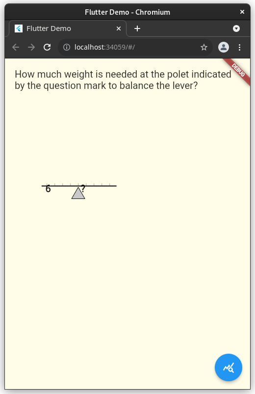
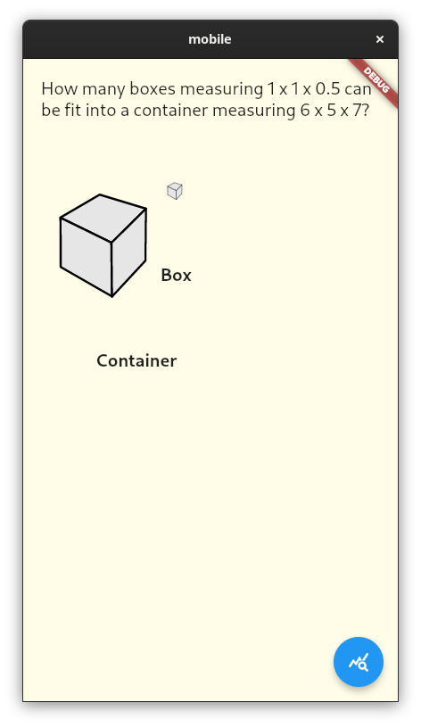

# Rustybrain


This is a WIP implementation of Gbrainy https://github.com/GNOME/gbrainy. Unlike the official version, I set out to port
using the rust programming language as i needed a project to put into practice what i learnt.

The original game uses xml with c# variable declarations embedded  within, but this project uses javascript for variable 
definitions

```xml
<game>
    <name>Lever</name>
    <type>Logic</type>
    <difficulty>All</difficulty>
    <question>How much weight is needed at the polet indicated by the question mark to balance the lever?</question>
    <tip>Consider the sentence attributed to Archimedes: 'Give me a lever long enough and a place to stand and I can move the Earth'.</tip>
    <rationale>A lever is in equilibrium when the objects placed on it are at a distances reciprocally proportional to their weights.</rationale>
    <svg file = "lever.svg" x = "0.1" y = "0.1" width = "0.8" height = "0.8"/>
    <variant>
        <variables>
            let right_pos = 2;
            let left_pos = 4;
            let left_weight = 2 + Math.floor((Math.random() *8))* 2;
            let force = left_pos * left_weight;
            let right_weight = force / right_pos;
        </variables>
        <string text = "?" x = "0.66" y = "0.4" centered = "yes" size = "large"/>
        <string text = "[left_weight]" x = "0.18" y = "0.4" centered = "yes" size = "large"/>
        <answer>[right_weight]</answer>
    </variant>
 </game>
```

## Project structure

- Most of the heavy lifting is done in the [libgbrainy](libgbrainy) project directory. It handles all the game definition loading, 
parsing e.t.c
Changes made here will affect all other subprojects.
- [ffi](ffi) directory hosts ffi bindings that can be consumed by external projects ([mobile](mobile) in our case
- [wasm](wasm) is used to generate WebAssembly bindings for use in the browser
- ([mobile](mobile) is flutter ui that uses both [ffi](ffi) (desktop, mobile) and [wasm](wasm) (web) to use the [libgbrainy](libgbrainy) engine 

## screenshots



Yes visually not so appealing but the aim of the projects was never about making a flashy ui. It was always about me
learning the ropes with Rust while working on a "real world " application which i chose to be a `basic` 
reimplementation of Gbrainy https://github.com/GNOME/gbrainy.

## Tools used

[Boa](ttps://docs.rs/Boa/latest/boa) javascript interpreter for our game definitions

[wasm-pack](https://github.com/rustwasm/wasm-pack) for building webassembly modules

[dart_js_facade_gen](https://github.com/dart-lang/js_facade_gen) For converting typescript definitions generated by wasm-pack to dartJs